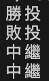

# ___HW3 (web programming)___
>學號： D1125913 姓名：鄭宇宸
## ___目錄___ 
+ 題目1  
+ 設計方法概述-1
+ 程式、執行畫面及其說明-1
+ 題目2  
+ 設計方法概述-2
+ 程式、執行畫面及其說明-2
+ 題目3 
+ 設計方法概述-3
+ 程式、執行畫面及其說明-3
+ 學習感想
+ 參考資料
- - -
### ___題目1：5.5.7 計算投手勝敗投___
- - -
### ___設計方法概述-1：___  
這題雖然有輸入四個變數（投手投球局數、投手自責分、該隊總得分、is_winning_team），但實際上只有使用到兩個變數做判斷，分別是：投球局數和是不是勝利隊伍。至於判斷式先從“有沒有小於五局”做判斷，若有的話則 result 為中繼；
接下來就是 elif 若大於五局且是勝利隊伍，result 為勝投；最後的 else 為不是勝利隊伍，result 為敗投。 
- - -

### ___程式、執行畫面及其說明-1：___  



Code:
```
def determine_pitcher_result(innings_pitched, earned_runs, total_runs, is_winning_team):
    result = ""
    if(innings_pitched < 5): 
        result = "中繼"
    elif(is_winning_team):
        result = "勝投"
    else:
        result = "敗投"

    return result

# 測試你的函式
print(determine_pitcher_result(6.0, 2, 5, True))   # 預期輸出: 勝投
print(determine_pitcher_result(7.0, 1, 3, False))  # 預期輸出: 敗投
print(determine_pitcher_result(4.2, 0, 2, True))   # 預期輸出: 中繼
print(determine_pitcher_result(3.0, 3, 1, False))  # 預期輸出: 中繼

```
- - -
### ___題目2：5.5.8 格式化球員打擊數據___
- - -
### ___設計方法概述-2：___  
打擊率根據題目提供的公式：安打數 / 總打擊數 來定義。格式化字串的部分只需要注意要表示出“打擊率的小數點後三位“即可。
- - -
### ___程式、執行畫面及其說明-2：___  


Code:
```
def format_batting_stats(name, at_bats, hits, home_runs):
    batting_average = 0.0
    # 在這裡計算打擊率
    batting_average = hits/at_bats
    # 在這裡格式化字串
    formatted_string = (
        f"{name} 的打擊數據：\n"
        f"打數： {at_bats}\n"
        f"安打數： {hits}\n"
        f"全壘打：{home_runs}\n"
        f"打擊率：{batting_average:.3f}"
    )
    
    return formatted_string

# 測試你的函式
stats = format_batting_stats("陳金鋒", 450, 150, 30)
print(stats)

```
- - -
### ___題目3：Q5.6.8___
- - -
### ___設計方法概述-3：___  
依照題目要求，宣告 BaseballPlayer 的類別後，依序宣告以下方法：
+ \__init__(self, name, number, position)：建構子，用於初始化球員的姓名、背號和守備位置。打擊率和全壘打數應初始化為預設值。
+ display_info(self)：顯示球員的所有資訊，包括姓名、背號、守備位置、打擊率和全壘打數。
+ increase_batting_record(self, hits, at_bats)：更新球員的打擊紀錄。這個方法接收本次打擊的安打數 (hits) 和打數 (at_bats)，並根據這些資訊更新球員的 batting_average。
+ hit_home_run(self)：當球員擊出全壘打時呼叫此方法，將球員的 home_runs 增加 1。
+ \__str__(self)：回傳呼叫 display_info 的值 + 換行 + 分隔線。
+ 屬性：name (字串)：球員的姓名、number (整數)、position (字串)、batting_average (浮點數，初始值： 0.0)、home_runs (整數，初始值：0)。

初始化所有數值後，display_info 的寫法跟 q5.5.8 相同，回傳一整個格式化字串；increase_batting_record 的判斷方法：若打擊數>0（不得為負值），則正常計算打擊率，反之打擊率：0.0（浮點數）；計算 hit_home_run 最為簡單，只要回傳家一後的 self 即可。
進階挑戰部分：建立一個新類別：隊伍，內有四個方法。新增方法：
+ \__init__：初始化。
+ add_player(self, player)：新增球員。
+ show_team_info(self)：顯示球隊所有球員資訊。
+ average_team_batting_average(self)：計算球隊的平均打擊率。

初始化內有姓名和一個 list 儲存；add_player 僅有對 list 使用內建的 append；show_team_info 使用迴圈印出分別印出每個球員，這邊會呼叫到寫在 BaseballPlayer 類別裡的 \___str___，該方法會呼叫該類別內部的方法 display_info。average_team_batting_average 內先判斷是否有成員，若沒有則回傳 0.0，若有的話，則總和全部成員的打擊率，回傳打擊率總合 / 人員數量。

測試部分：
宣告三個變數（player1、player2、player3）= BaseballPlayer(內部資料)，並印出，宣告一個 team 後，則是使用 team.append 去新增剛宣告的成員，之後使用方法 show_team_info。

重要的部分：\__str__會在 “__調用 print__” 或 “__轉成字串__” 的函數時被觸發。 BaseballPlayer 的 display_info 調用時沒有觸發格式的改變，就是因為該方法只是回傳一個字串，而不是物件。在測試時使用 print(player)時，因為 player 是物件，會調用將物件轉字串的方法\__str__，因此才能觸發裡面的格式優化。

- - -
### ___程式、執行畫面及其說明-3：___  


Code:
```
class BaseballPlayer:
    def __init__(self, name, number, position):
        self.name = name
        self.number = number
        self.position = position
        self.batting_average = 0.0
        self.homerun = 0
    
    def display_info(self):
        return (
            f"{self.name} 的打擊數據：\n"
            f"背號： {self.number}\n"
            f"位置： {self.position}\n"
            f"打擊率：{self.batting_average:.3f}\n"
            f"全壘打數：{self.homerun}"
        )
    
    def increase_batting_record(self, hits, at_bats):
        if(at_bats>0):
            self.batting_average = hits / at_bats
        else:
            self.batting_average = 0.0
        return self
    
    def hit_home_run(self):
        self.homerun += 1
        return self
    
    def __str__(self):
        return (self.display_info() + "\n" + "-"*20)
    
class Team:
    def __init__(self, name):
        self.name = name
        self.players = []

    def add_player(self, player):
        self.players.append(player)

    def show_team_info(self):
        print(f"\n球隊：{self.name} 全體球員資訊：")
        for player in self.players:
            print(player)

    def average_team_batting_average(self):
        if not self.players:
            return 0.0
        total = sum(p.batting_average for p in self.players)
        return total / len(self.players)


player1 = BaseballPlayer("A", 0, "投手")
player2 = BaseballPlayer("B", 1, "捕手")
player3 = BaseballPlayer("C", 2, "投手")

player3.increase_batting_record(2, 3)
print(player3.display_info() + "\n" + "-"*20)

player3.increase_batting_record(1, 4)
print(player3.display_info() + "\n" + "-"*20)

player3.hit_home_run()
print(player3.display_info() + "\n" + "-"*20)

team1 = Team("FCU")
team1.add_player(player1)
team1.add_player(player2)
team1.add_player(player3)

team1.show_team_info()
```
- - -
### ___學習感想：___  
本次作業圍繞在操作基本的 python 語法上，好比判斷式、格式化字串，還有進階一點的物件導向設計，物件導向設計也是我唯一需要邊查觀念邊實作的內容，因為對該方面的操作不太熟悉。雖然這份作業沒花多少時間就可以寫完，不過要專注於作業三的觀念，在設計類別內的方法時，因為定義和 C/C++ 先定義不一樣，回傳值的類別（int, float）要格外注意。寫完後經 chatgpt 修改優化後，發現更精簡的寫法：
```
total = sum(p.batting_average for p in self.players)
```
雖然作業三沒有使用到 5.6 章節全部的內容，不過還是需要不斷回去重看才能理解基本的物件導向設計的一些概念與技巧，尤其是對 \__str__ 的應用，在查找資料時覺得特別有趣，希望能越來越熟悉 python 中一些常見的用法。

- - -
# 參考資料
[1] <https://hackmd.io/@nlhsueh/r1E5rknCn/%2FS1FfzKeNT#568-Exercise>   
[2] <https://www.runoob.com/note/41154>